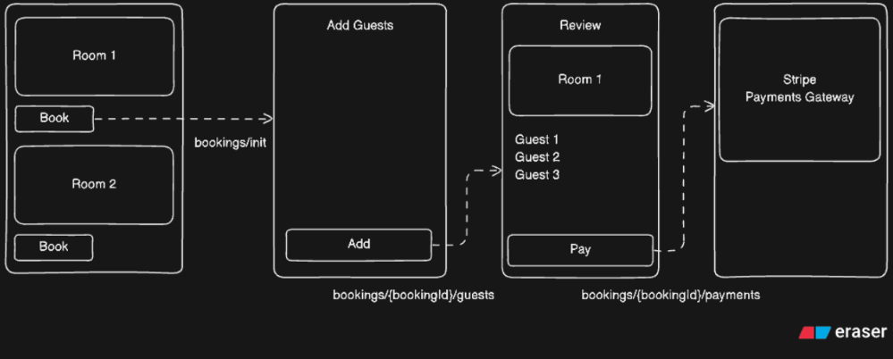

## Booking Flow

The booking flow allows users to:

1. Select a room
2. Add guests
3. Review the booking
4. Make payment through Stripe

### Why do we need the Decorator Pricing Strategy?

- **Flexible pricing:** It allows us to add different pricing rules (Surge, Occupancy, Urgency, Holiday, etc.) dynamically without modifying the existing pricing logic.

- **Follows Open/Closed Principle:** We can introduce new pricing strategies without changing the existing `BasePricingStrategy` or other strategies.

- **Avoids a large conditional class:** Without Decorator, we might end up with a single class containing many `if-else` conditions for different pricing rules, making the code difficult to maintain.

- **Strategies can be combined:** Multiple pricing rules can be chained together, where each decorator receives the price from the previous strategy and applies its own adjustment.

- **Easy to extend and maintain:** If a new rule such as `WeekendPricingStrategy` is required, we can simply create another decorator and add it to the chain without affecting existing code.
